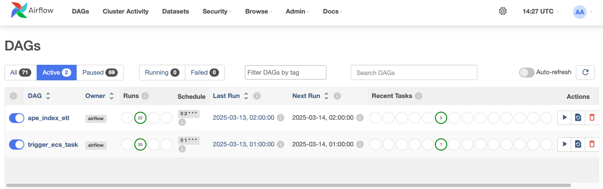

# Ape Index - BAYC NFT Analytics

Ape Index is a **data engineering project** that provides analytics on the **Bored Ape Yacht Club (BAYC) NFT marketplace** by processing **Etherscan transaction data** to highlight **sales trends, key buyers/sellers, and marketplace comparisons**.

The project consists of **two data pipelines**:
- **API Service Pipeline**: Provides NFT analytics via **FastAPI**.
- **Data Warehouse Pipeline**: Uses **Spark (EMR) and Redshift** to power **Tableau dashboard**.

**Website**: [Ape Index - BAYC NFT 分析儀表板](<https://ape-index-nft.com/>)  
**Tableau Dashboard**: [Ape Index - BAYC NFT 分析儀表板](<https://public.tableau.com/app/profile/renee.hsu1430/viz/shared/48GB7T75P>)

---

## Table of Contents
- [Data Pipeline](#data-pipeline)
- [Orchestration](#orchestration)
- [API](#api)
- [Visualization](#visualization)
- [Technologies Used](#technologies-used)
- [Contact](#contact)

---

## Data Pipeline
### Architecture

Ape Index is structured into two main pipelines that handle **real-time NFT analytics and data warehousing**.

### **1. API Pipeline (Pandas & MySQL)**
> View related code: [manager.py](./src/etl/db/manager.py), [extract.py](./src/etl/extract.py), [transform.py](./src/etl/transform.py), [load.py](./src/etl/load.py), [pipeline.py](./src/etl/pipeline.py)

#### **Extract**
- **Playwright Web Scraper** fetches NFT transactions from **Etherscan**.
- Uses a **proxy service to avoid scraper detection when crawling in ECS**.
- Raw data is **stored in Amazon S3**.

#### **Transform**
- **Pandas**
  - Cleans and processes raw transaction data by **removing duplicates, filtering out invalid entries, and extract USD value as a string**.
  - Normalizes **buyers, sellers, and marketplaces** into separate relational tables.

#### **Load**
- **Amazon RDS (MySQL)** stores **processed transaction data**.
- **FastAPI** provides an API to access **NFT analytics**, interacting with **RDS via SQLAlchemy**.
- Website **containerized with Docker** and deployed on **Amazon ECS (Fargate) using Amazon ECR**.

---

### **2. Data Warehouse Pipeline (Spark & Redshift)**
> View code: [spark_etl.py](./src/data_warehouse/etl/spark_etl.py)
#### **Extract**
- Reads **raw transaction data from S3**.

#### **Transform**
- **Spark (AWS EMR)**
  - Computes **seller addresses** by applying a **window function (lag)** on transactions grouped by `token_id`, ensuring that each sale is linked to its previous buyer.
  - **Maps transactions to Redshift dimension tables** for efficient querying.

#### **Load**
- Stores structured data in **Amazon Redshift**.
- **Tableau BI Dashboard** connects to Redshift for insights.

##### **Database Schema (Redshift)**
The data warehouse follows a **star schema**, with `transactions_fact` storing NFT transactions and linking to dimension tables.

**Fact Table (`transactions_fact`)**  
Stores all NFT transactions and references dimension tables for buyers, sellers, marketplaces, and actions.

| Column Name        | Type                | Description                                       |
|--------------------|--------------------|---------------------------------------------------|
| `time_id`         | BIGINT (FK)         | Transaction timestamp (links to `time_dim`).     |
| `buyer_id`        | BIGINT (FK)         | Buyer address (links to `addresses_dim`).        |
| `seller_id`       | BIGINT (FK, Nullable) | Seller address (links to `addresses_dim`).       |
| `token_id`        | BIGINT              | NFT token ID.                                     |
| `market_id`       | BIGINT (FK)         | Marketplace ID (links to `marketplaces_dim`).     |
| `action_id`       | BIGINT (FK)         | Transaction type (links to `actions_dim`).       |
| `price`           | DOUBLE PRECISION    | Transaction price in USD.                        |
| `transaction_hash`| VARCHAR(255)        | Unique transaction identifier.                   |

**Dimension Tables**
- `time_dim (time_id, datetime)`
- `addresses_dim (address_id, address)`
- `marketplaces_dim (market_id, marketplace_name)`
- `actions_dim (action_id, action_name)`

---

## Orchestration

**Apache Airflow**, deployed on **Amazon EC2**, orchestrates both pipelines.

- **Amazon ECS** executes **Pandas-based ETL** for the API service using **ECSOperator**.
  > [View DAG](./src/etl/dags/pipeline_dags.py)
- **Amazon EMR (Spark)** processes large-scale transactions for **Redshift** using **EMROperator**.
  > [View DAG](./src/etl/dags/emr_dags.py)
- Automated **scheduling**, **execution**, and **retries**.

---

## API
> View code: [main.py](./src/api/main.py)

#### **Protocol & Host**
- **Protocol:** HTTPS  
- **Host Name:** `https://ape-index-nft.com/`  
- **Method:** `GET`

#### **API Endpoints**
| Endpoint                                  | Purpose                                                                                                           |
|-------------------------------------------|-------------------------------------------------------------------------------------------------------------------|
| `/api/v1/time-based-data`                 | Retrieve aggregated sales volume, average price, and highest sale over different time intervals.                  |
| `/api/v1/top-buyers-sellers`              | Identify the top 5 buyers and sellers based on transaction volume.                                                |
| `/api/v1/marketplace-comparison`          | Compare NFT sales across different marketplaces.                                                                  |
| `/api/v1/top-resale-token`                | Fetch the top 5 NFT resales with the highest profit margin.                                                       |
| `/api/v1/token-transaction?token_id={id}` | Get historical transactions for a specific NFT token.                                                             |
| `/api/v1/nft-details?token_id={id}`       | Fetch metadata (image, rarity, attributes) for a specific NFT by calling a third-party API.                   |

---

## Visualization
- **[Website Dashboard](<https://ape-index-nft.com/>) (HTML, JS, Plotly.js)** visualizes **NFT transaction insights**.

  

  - **Time-Based Analysis**  
    Displays key sales metrics over a selected time range, including the highest-priced BAYC NFT sold, total volume, average price, and transaction count.

  - **Top Buyers and Sellers**  
    Identifies the top five BAYC NFT buyers and sellers with the highest transaction volume.

  - **Marketplace Comparison**  
    Compares total sales volume and number of transactions across different NFT marketplaces for BAYC NFTs.

  - **Top Resale Profit NFTs**  
    Highlights the five BAYC NFTs with the highest single-transaction resale profits, showing which tokens yielded the greatest gains.

  - **NFT Transaction History**  
    Allows users to input a specific Token ID and view its historical transaction data, including price trends.

- **Tableau** connects to **Redshift** for [BI dashboard](<https://public.tableau.com/app/profile/renee.hsu1430/viz/shared/48GB7T75P>).

  

---

## Technologies Used
- **Web Scraping**: Playwright
- **Backend**: FastAPI, SQLAlchemy
- **Web Server & Reverse Proxy**: Nginx
- **Storage**: Amazon S3
- **ETL (API Pipeline)**: Pandas, Docker, Amazon ECR, Amazon ECS (Fargate), MySQL (Amazon RDS)
- **ETL (Data Warehouse Pipeline)**: Apache Spark, Amazon EMR, Amazon Redshift
- **Orchestration**: Apache Airflow
- **BI & Visualization**: Tableau, HTML, JS, Plotly.js
- **Infrastructure**: Amazon EC2, Amazon ECS (Fargate), Amazon Route 53

---

## Contact

Renee Hsu

[piaoyunh@gmail.com](mailto:piaoyunh@gmail.com)

[LinkedIn](https://www.linkedin.com/in/reneepyh/)
